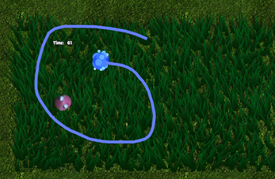
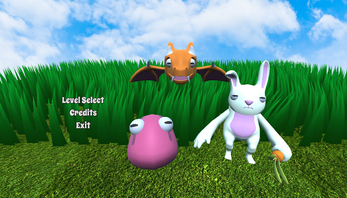

# Godot_Monster_Ranger

Prototype inspired by the classic **Pokémon Ranger** series.  
Players use their mouse to draw circles around wild monsters to capture them, combining precision, timing, and strategy. The game features **5 exciting levels**, each with increasing difficulty and new monster behaviors to challenge your skills.

> This project was developed as a hobby prototype and is open-source for anyone interested in continuing or expanding it.  
> The current version focuses on **PC gameplay**, although an early mobile version was explored during development.

## Preview

  
*Draw circles around monsters to capture them quickly before they escape!*

  
*Face different monsters and progress through increasingly challenging levels.*

## Download

You can try the executable version here:  
👉 **[Monster Ranger on itch.io](https://alexmp001.itch.io/monster-ranger)**

## License

This project is released under the **MIT License** — feel free to use, modify, and distribute it.

## Repository

Source code available here:  
**[https://github.com/AlejandroMonteseirin/Godot_Monster_Ranger](https://github.com/AlejandroMonteseirin/Godot_Monster_Ranger)**
